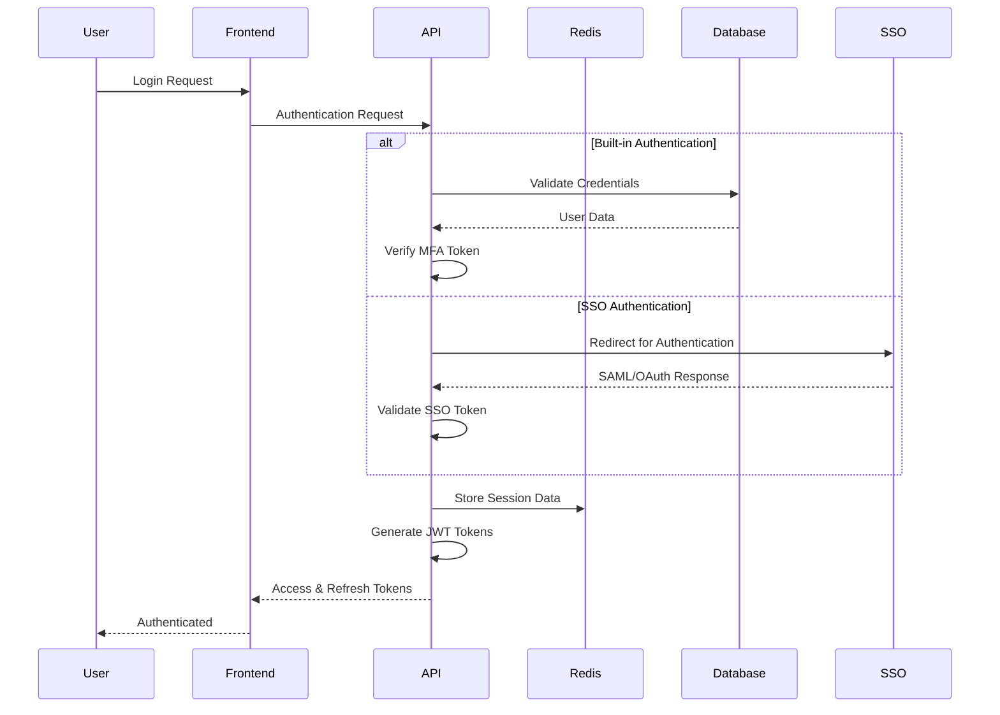

# User Management & Authentication

## Authentication Architecture

### Hybrid Authentication System

The MSS platform implements a flexible authentication system supporting both built-in credentials and enterprise Single Sign-On (SSO) integration.

#### Built-in Authentication (Primary)
- **Email/Password**: Strong password policy enforcement
- **Multi-Factor Authentication**: TOTP-based MFA using authenticator apps
- **Password Recovery**: Secure email-based password reset flow
- **Account Security**: Account lockout protection, login attempt monitoring
- **Session Management**: JWT-based tokens with refresh token rotation

#### Enterprise SSO (Optional)
- **SAML 2.0**: Integration with enterprise identity providers
- **OAuth2/OIDC**: Support for modern OAuth providers (Azure AD, Google Workspace, Okta)
- **Just-in-Time Provisioning**: Automatic user creation from SSO attributes
- **Fallback Authentication**: Graceful fallback to built-in auth if SSO fails

### Authentication Flow



## Multi-Tenant Organization Structure

### Organization Types

#### Customer Organizations
Organizations that purchase cybersecurity services from the MSS provider.

**Organization Properties:**
- Unique organization identifier
- Company name and metadata
- Billing and subscription information
- Security settings and policies
- Custom branding configuration
- SSO configuration (if enabled)

#### MSS Provider Organization
The internal organization representing the service provider company.

**Special Properties:**
- System administration capabilities
- Cross-customer visibility (where authorized)
- Platform configuration access
- Global reporting and analytics

### User Roles & Permissions

#### Customer Organization Roles

**Admin Users**
- **Scope**: Full organization permissions
- **Capabilities**:
  - Manage organization users and roles
  - Configure organization settings
  - Access all security reports and dashboards
  - Submit and manage intervention requests
  - View billing and subscription information
  - Configure SSO settings (if available)

**Report Viewers**  
- **Scope**: Read-only access to security information
- **Capabilities**:
  - View vulnerability assessment reports
  - Access incident and compliance reports
  - View security dashboard and metrics
  - Export reports (with watermarks)
  - Cannot submit requests or manage users

**Request Users**
- **Scope**: Can interact with MSS provider for services
- **Capabilities**:
  - Submit intervention requests
  - Track request status and progress
  - Communicate with assigned technicians
  - View basic security status overview
  - Limited access to relevant reports

**Basic Users**
- **Scope**: Limited dashboard access for awareness
- **Capabilities**:
  - View organization security overview
  - Access basic security notifications
  - View personal account settings
  - Cannot submit requests or access detailed reports

#### MSS Provider Organization Roles

**Super Admins**
- **Scope**: Platform-wide administration
- **Capabilities**:
  - Manage platform configuration
  - Assign technician access to customers
  - Platform-wide reporting and analytics
  - Emergency access to any customer environment
  - User and organization management across platform

**Technicians**
- **Scope**: Individual customer environment access
- **Capabilities**:
  - Access assigned customer environments via remote tools
  - Document work performed and interventions
  - Communicate with customer users
  - View customer security status and history
  - Cannot access customer credentials directly
  - Limited to assigned customer organizations only

**Security Analysts**
- **Scope**: Cross-customer analysis and reporting
- **Capabilities**:
  - Generate reports across multiple customers
  - Perform trend analysis and threat intelligence
  - Create security recommendations
  - Access aggregated security data
  - Cannot access customer environments directly

**Account Managers**
- **Scope**: Customer relationship and service delivery
- **Capabilities**:
  - Customer communication and relationship management
  - Service delivery oversight and reporting
  - Limited access to customer security status
  - Cannot access technical environments
  - Focus on business and service aspects

## Access Control Implementation

### Individual Technician Access Assignment

Unlike traditional group-based access control, the MSS platform uses individual assignment of technicians to customer organizations.

#### Access Assignment Model
```sql
-- Technician-to-Customer Access Mapping
technician_customer_access (
    id UUID PRIMARY KEY,
    technician_id UUID REFERENCES users(id),
    customer_org_id UUID REFERENCES organizations(id),
    granted_by UUID REFERENCES users(id),
    access_level VARCHAR(50) DEFAULT 'full_access',
    granted_at TIMESTAMP,
    expires_at TIMESTAMP NULL,
    revoked_at TIMESTAMP NULL
)
```

#### Access Levels
- **full_access**: Complete access to customer environment and systems
- **read_only**: View-only access for assessment and monitoring
- **emergency**: Temporary elevated access for incident response
- **limited**: Restricted access to specific systems or timeframes

#### Assignment Features
- **Granular Control**: Each technician individually assigned to specific customers
- **Multiple Assignments**: Technicians can be assigned to multiple customers
- **Audit Trail**: Complete history of access grants, modifications, and revocations
- **Temporary Access**: Time-based access with automatic expiration
- **Emergency Access**: Rapid access granting for urgent situations

### Permission Enforcement

#### API-Level Authorization
```typescript
// Example authorization middleware
async function authorizeCustomerAccess(req, res, next) {
  const { user } = req;
  const { customerId } = req.params;
  
  if (user.role === 'super_admin') {
    return next(); // Super admins have access to all customers
  }
  
  if (user.organizationId === customerId) {
    return next(); // Customer users accessing their own org
  }
  
  if (user.role === 'technician') {
    const hasAccess = await checkTechnicianAccess(user.id, customerId);
    if (hasAccess && !hasAccess.revoked_at) {
      return next();
    }
  }
  
  return res.status(403).json({ error: 'Insufficient permissions' });
}
```

#### Frontend Route Protection
```typescript
// Role-based route protection
function ProtectedRoute({ children, requiredRole, customerId }) {
  const { user } = useAuth();
  
  const hasAccess = useMemo(() => {
    if (user.role === 'super_admin') return true;
    if (user.organizationId === customerId) return true;
    if (requiredRole && user.role !== requiredRole) return false;
    
    return checkUserPermissions(user, requiredRole, customerId);
  }, [user, requiredRole, customerId]);
  
  if (!hasAccess) {
    return <AccessDeniedPage />;
  }
  
  return children;
}
```

## User Management Features

### User Lifecycle Management

#### User Registration & Onboarding
1. **Account Creation**: 
   - Email verification required
   - Strong password policy enforcement
   - Organization assignment (customer users)
   - Role assignment by organization admins

2. **MFA Setup**:
   - TOTP secret generation
   - QR code for authenticator app setup
   - Backup code generation
   - MFA enforcement policies

3. **Access Provisioning**:
   - Role-based permission assignment
   - Customer access assignment (for technicians)
   - Initial security training requirements
   - Account activation workflows

#### User Profile Management
- **Personal Information**: Name, contact details, preferences
- **Security Settings**: Password changes, MFA configuration, active sessions
- **Access History**: Login history, permission changes, access requests
- **Notification Preferences**: Email, in-app, SMS notification settings

### Organization Management

#### Customer Organization Admin Features
- **User Management Dashboard**: View, create, modify, and deactivate users
- **Role Assignment**: Assign and modify user roles within organization
- **Access Monitoring**: View user activity and access patterns
- **Security Policies**: Configure organization-specific security requirements
- **SSO Configuration**: Set up and manage SSO integration

#### MSS Provider Admin Features
- **Cross-Organization Visibility**: View users across all customer organizations
- **Technician Assignment**: Assign technicians to customer organizations
- **Platform Configuration**: Manage global platform settings
- **Audit and Compliance**: Generate compliance reports and audit trails

## Session Management

### JWT Token Strategy
- **Access Tokens**: Short-lived (15 minutes) for API authentication
- **Refresh Tokens**: Longer-lived (7 days) for token renewal
- **Token Rotation**: Refresh tokens rotated on each use
- **Session Storage**: Active sessions tracked in Redis
- **Revocation**: Immediate token invalidation capability

### Session Security Features
- **Device Tracking**: Track active sessions across devices
- **Concurrent Session Limits**: Configurable limits per user
- **Suspicious Activity Detection**: Unusual login patterns and locations
- **Session Timeout**: Automatic logout after inactivity
- **Secure Logout**: Complete session cleanup on logout

## Audit & Compliance

### User Activity Logging
All user authentication and authorization events are logged for compliance and security monitoring:

```sql
-- Audit log structure for user activities
audit_logs (
    id UUID PRIMARY KEY,
    user_id UUID REFERENCES users(id),
    org_id UUID REFERENCES organizations(id),
    action VARCHAR(100) NOT NULL,
    resource_type VARCHAR(50),
    resource_id UUID,
    details JSONB,
    ip_address INET,
    user_agent TEXT,
    success BOOLEAN,
    created_at TIMESTAMP
)
```

### Compliance Features
- **SOC2 Type II**: User access controls and monitoring
- **ISO27001**: Identity and access management framework
- **GDPR**: User data protection and privacy controls
- **HIPAA**: Healthcare data access controls (when applicable)

### Reporting Capabilities
- **User Access Reports**: Who has access to what resources
- **Login Activity**: Detailed authentication logs and patterns
- **Permission Changes**: History of role and access modifications
- **Failed Access Attempts**: Security monitoring and threat detection

This comprehensive user management system provides the security, flexibility, and compliance features necessary for a professional cybersecurity MSS platform.