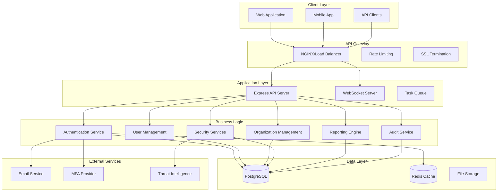
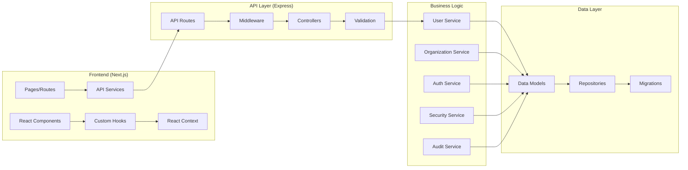
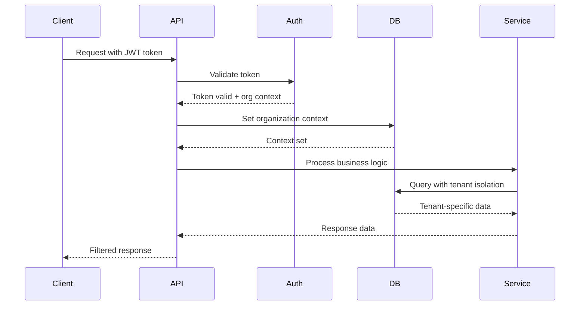
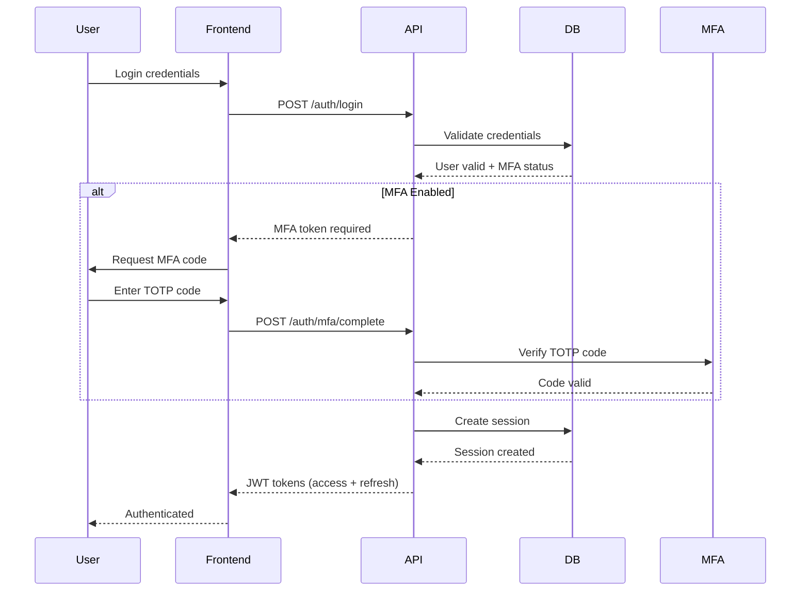
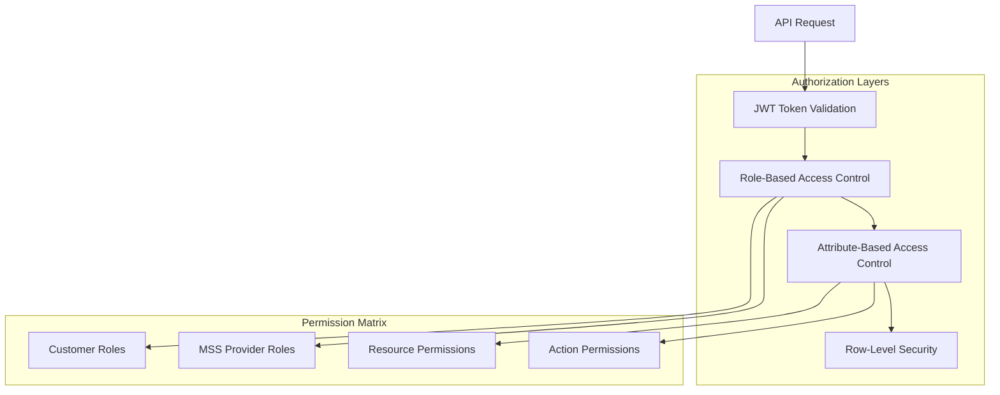
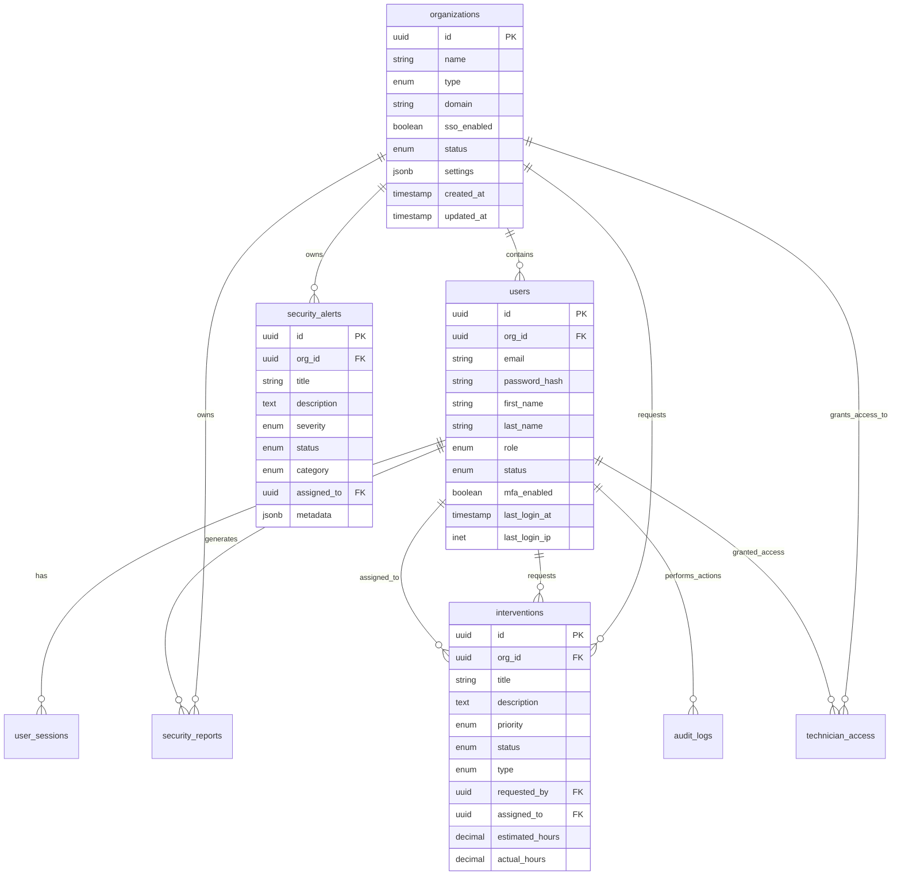
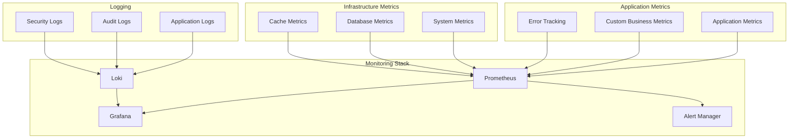
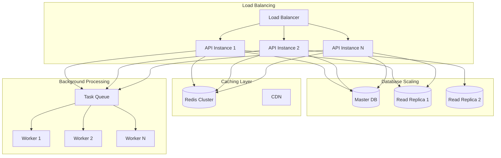
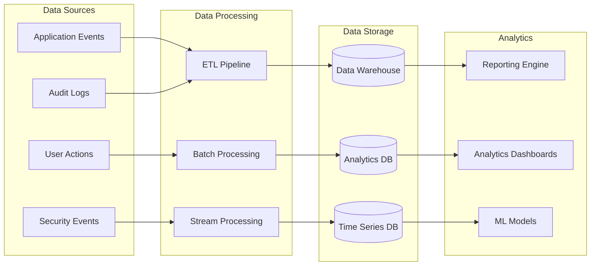

# MSS Platform Architecture Documentation

## 🏗️ Architecture Overview

The MSS Platform is designed as a modern, scalable, multi-tenant cybersecurity management system built with a microservices-inspired architecture using a monorepo approach.

## 🎯 Design Principles

### Core Principles

1. **Multi-Tenancy First**: Complete data isolation between organizations
2. **Security by Design**: Security considerations at every layer
3. **Scalability**: Designed to handle enterprise-scale deployments
4. **Compliance Ready**: Built for SOC2, ISO27001, and other standards
5. **Developer Experience**: Fast development cycles with comprehensive tooling
6. **Observability**: Full monitoring, logging, and tracing capabilities

### Architecture Patterns

- **Clean Architecture**: Separation of concerns with clear boundaries
- **Domain-Driven Design**: Business logic organized around domain concepts
- **CQRS (Command Query Responsibility Segregation)**: Separate read/write operations
- **Event Sourcing**: Audit trail and event-driven architecture
- **API-First Design**: APIs designed before implementation

## 🏛️ System Architecture

### High-Level Architecture



### Component Architecture



## 🏢 Multi-Tenant Architecture

### Tenant Isolation Strategy

The platform uses a **shared database, separate schema** approach for multi-tenancy:

1. **Organization-Level Isolation**: Complete data separation by organization
2. **Row-Level Security**: Database-enforced tenant isolation
3. **Application-Level Controls**: Additional security at the application layer
4. **Audit Trail**: Complete audit logging per organization

### Tenant Data Model

```sql
-- Core organization table
CREATE TABLE organizations (
    id UUID PRIMARY KEY DEFAULT gen_random_uuid(),
    name VARCHAR(255) NOT NULL,
    type organization_type NOT NULL, -- 'customer' | 'mss_provider'
    domain VARCHAR(255),
    sso_enabled BOOLEAN DEFAULT FALSE,
    status organization_status DEFAULT 'active',
    settings JSONB DEFAULT '{}',
    created_at TIMESTAMP WITH TIME ZONE DEFAULT CURRENT_TIMESTAMP,
    updated_at TIMESTAMP WITH TIME ZONE DEFAULT CURRENT_TIMESTAMP,
    created_by UUID
);

-- Row-level security policy example
ALTER TABLE users ENABLE ROW LEVEL SECURITY;

CREATE POLICY user_organization_isolation ON users
    FOR ALL TO application_role
    USING (org_id = current_setting('app.current_org_id')::UUID);
```

### Multi-Tenant Request Flow



## 🔐 Security Architecture

### Authentication Flow



### Authorization Architecture



### Role-Based Access Control

#### Customer Organization Roles

```typescript
const CUSTOMER_ROLES = {
  ADMIN: 'admin',
  REPORT_VIEWER: 'report_viewer', 
  REQUEST_USER: 'request_user',
  BASIC_USER: 'basic_user'
} as const;

const CUSTOMER_PERMISSIONS = {
  [CUSTOMER_ROLES.ADMIN]: [
    'users:create',
    'users:read', 
    'users:update',
    'users:delete',
    'reports:read',
    'alerts:read',
    'interventions:create',
    'interventions:read'
  ],
  [CUSTOMER_ROLES.REPORT_VIEWER]: [
    'reports:read',
    'alerts:read'
  ],
  [CUSTOMER_ROLES.REQUEST_USER]: [
    'interventions:create',
    'interventions:read',
    'reports:read'
  ],
  [CUSTOMER_ROLES.BASIC_USER]: [
    'dashboard:read'
  ]
};
```

#### MSS Provider Roles

```typescript
const MSS_ROLES = {
  SUPER_ADMIN: 'super_admin',
  ACCOUNT_MANAGER: 'account_manager',
  SECURITY_ANALYST: 'security_analyst',
  TECHNICIAN: 'technician'
} as const;

const MSS_PERMISSIONS = {
  [MSS_ROLES.SUPER_ADMIN]: [
    '*:*' // All permissions
  ],
  [MSS_ROLES.ACCOUNT_MANAGER]: [
    'organizations:create',
    'organizations:read',
    'organizations:update',
    'users:create',
    'users:read',
    'users:update',
    'reports:read'
  ],
  [MSS_ROLES.SECURITY_ANALYST]: [
    'alerts:read',
    'alerts:update',
    'reports:create',
    'reports:read',
    'reports:update',
    'interventions:read',
    'interventions:assign'
  ],
  [MSS_ROLES.TECHNICIAN]: [
    'interventions:read',
    'interventions:update',
    'customer_access:read',
    'remote_access:create'
  ]
};
```

## 💾 Data Architecture

### Database Schema Design

#### Core Entities

```sql
-- Organizations (Multi-tenant root)
CREATE TABLE organizations (
    id UUID PRIMARY KEY DEFAULT gen_random_uuid(),
    name VARCHAR(255) NOT NULL,
    type organization_type NOT NULL,
    domain VARCHAR(255),
    sso_enabled BOOLEAN DEFAULT FALSE,
    status organization_status DEFAULT 'active',
    settings JSONB DEFAULT '{}',
    created_at TIMESTAMP WITH TIME ZONE DEFAULT CURRENT_TIMESTAMP,
    updated_at TIMESTAMP WITH TIME ZONE DEFAULT CURRENT_TIMESTAMP,
    created_by UUID
);

-- Users (Belongs to organization)
CREATE TABLE users (
    id UUID PRIMARY KEY DEFAULT gen_random_uuid(),
    org_id UUID NOT NULL REFERENCES organizations(id),
    email VARCHAR(255) NOT NULL,
    password_hash VARCHAR(255),
    first_name VARCHAR(100) NOT NULL,
    last_name VARCHAR(100) NOT NULL,
    role user_role NOT NULL,
    status user_status DEFAULT 'active',
    mfa_enabled BOOLEAN DEFAULT FALSE,
    mfa_secret VARCHAR(255),
    mfa_backup_codes TEXT[],
    email_verified BOOLEAN DEFAULT FALSE,
    last_login_at TIMESTAMP WITH TIME ZONE,
    last_login_ip INET,
    failed_login_attempts INTEGER DEFAULT 0,
    locked_until TIMESTAMP WITH TIME ZONE,
    created_at TIMESTAMP WITH TIME ZONE DEFAULT CURRENT_TIMESTAMP,
    updated_at TIMESTAMP WITH TIME ZONE DEFAULT CURRENT_TIMESTAMP,
    created_by UUID,
    UNIQUE(org_id, email)
);

-- Sessions (User authentication sessions)
CREATE TABLE user_sessions (
    id UUID PRIMARY KEY DEFAULT gen_random_uuid(),
    user_id UUID NOT NULL REFERENCES users(id),
    refresh_token_hash VARCHAR(255) NOT NULL,
    device_fingerprint VARCHAR(255),
    ip_address INET,
    user_agent TEXT,
    status session_status DEFAULT 'active',
    expires_at TIMESTAMP WITH TIME ZONE NOT NULL,
    created_at TIMESTAMP WITH TIME ZONE DEFAULT CURRENT_TIMESTAMP,
    revoked_at TIMESTAMP WITH TIME ZONE,
    revoked_reason VARCHAR(255)
);
```

#### Security Entities

```sql
-- Security Alerts
CREATE TABLE security_alerts (
    id UUID PRIMARY KEY DEFAULT gen_random_uuid(),
    org_id UUID NOT NULL REFERENCES organizations(id),
    title VARCHAR(255) NOT NULL,
    description TEXT NOT NULL,
    severity alert_severity NOT NULL,
    status alert_status DEFAULT 'open',
    category alert_category NOT NULL,
    source VARCHAR(100),
    affected_assets TEXT[],
    assigned_to UUID REFERENCES users(id),
    metadata JSONB DEFAULT '{}',
    created_at TIMESTAMP WITH TIME ZONE DEFAULT CURRENT_TIMESTAMP,
    updated_at TIMESTAMP WITH TIME ZONE DEFAULT CURRENT_TIMESTAMP,
    resolved_at TIMESTAMP WITH TIME ZONE
);

-- Security Reports
CREATE TABLE security_reports (
    id UUID PRIMARY KEY DEFAULT gen_random_uuid(),
    org_id UUID NOT NULL REFERENCES organizations(id),
    title VARCHAR(255) NOT NULL,
    type report_type NOT NULL,
    status report_status DEFAULT 'draft',
    generated_by UUID NOT NULL REFERENCES users(id),
    approved_by UUID REFERENCES users(id),
    summary TEXT,
    findings JSONB DEFAULT '[]',
    report_period_start DATE,
    report_period_end DATE,
    file_path VARCHAR(500),
    created_at TIMESTAMP WITH TIME ZONE DEFAULT CURRENT_TIMESTAMP,
    updated_at TIMESTAMP WITH TIME ZONE DEFAULT CURRENT_TIMESTAMP,
    published_at TIMESTAMP WITH TIME ZONE
);

-- Interventions (Customer requests for security services)
CREATE TABLE interventions (
    id UUID PRIMARY KEY DEFAULT gen_random_uuid(),
    org_id UUID NOT NULL REFERENCES organizations(id),
    title VARCHAR(255) NOT NULL,
    description TEXT NOT NULL,
    priority intervention_priority NOT NULL,
    status intervention_status DEFAULT 'requested',
    type intervention_type NOT NULL,
    requested_by UUID NOT NULL REFERENCES users(id),
    assigned_to UUID REFERENCES users(id),
    estimated_hours DECIMAL(5,2),
    actual_hours DECIMAL(5,2),
    scheduled_for TIMESTAMP WITH TIME ZONE,
    completed_at TIMESTAMP WITH TIME ZONE,
    work_log JSONB DEFAULT '[]',
    created_at TIMESTAMP WITH TIME ZONE DEFAULT CURRENT_TIMESTAMP,
    updated_at TIMESTAMP WITH TIME ZONE DEFAULT CURRENT_TIMESTAMP
);
```

#### Audit and Compliance

```sql
-- Comprehensive audit logging
CREATE TABLE audit_logs (
    id UUID PRIMARY KEY DEFAULT gen_random_uuid(),
    user_id UUID REFERENCES users(id),
    session_id UUID,
    org_id UUID REFERENCES organizations(id),
    action VARCHAR(50) NOT NULL,
    resource_type VARCHAR(50) NOT NULL,
    resource_id UUID,
    details JSONB NOT NULL,
    ip_address INET,
    user_agent TEXT,
    success BOOLEAN DEFAULT TRUE,
    error_message TEXT,
    timestamp TIMESTAMP WITH TIME ZONE DEFAULT CURRENT_TIMESTAMP
);

-- Technician access matrix (MSS provider access to customer orgs)
CREATE TABLE technician_access (
    id UUID PRIMARY KEY DEFAULT gen_random_uuid(),
    technician_id UUID NOT NULL REFERENCES users(id),
    customer_org_id UUID NOT NULL REFERENCES organizations(id),
    access_level access_level NOT NULL,
    granted_by UUID NOT NULL REFERENCES users(id),
    granted_at TIMESTAMP WITH TIME ZONE DEFAULT CURRENT_TIMESTAMP,
    expires_at TIMESTAMP WITH TIME ZONE,
    revoked_at TIMESTAMP WITH TIME ZONE,
    revoked_by UUID REFERENCES users(id),
    revoked_reason VARCHAR(255),
    allowed_services TEXT[],
    ip_restrictions INET[],
    time_restrictions JSONB,
    status access_status DEFAULT 'active',
    notes TEXT
);
```

### Data Relationships



### Caching Strategy

```typescript
// Redis caching layers
const CACHE_KEYS = {
  USER_SESSION: (sessionId: string) => `session:${sessionId}`,
  USER_PERMISSIONS: (userId: string) => `permissions:${userId}`,
  ORG_SETTINGS: (orgId: string) => `org:settings:${orgId}`,
  SECURITY_ALERTS: (orgId: string) => `alerts:${orgId}`,
  DASHBOARD_DATA: (userId: string) => `dashboard:${userId}`,
  MFA_ATTEMPTS: (userId: string) => `mfa:attempts:${userId}`
};

const CACHE_TTL = {
  SESSION: 15 * 60, // 15 minutes
  PERMISSIONS: 30 * 60, // 30 minutes  
  ORG_SETTINGS: 60 * 60, // 1 hour
  DASHBOARD_DATA: 5 * 60, // 5 minutes
  MFA_ATTEMPTS: 5 * 60 // 5 minutes
};

// Caching service implementation
class CacheService {
  async getUserSession(sessionId: string): Promise<UserSession | null> {
    const cached = await redis.get(CACHE_KEYS.USER_SESSION(sessionId));
    if (cached) return JSON.parse(cached);
    
    const session = await this.fetchSessionFromDB(sessionId);
    if (session) {
      await redis.setex(
        CACHE_KEYS.USER_SESSION(sessionId),
        CACHE_TTL.SESSION,
        JSON.stringify(session)
      );
    }
    return session;
  }
  
  async invalidateUserCache(userId: string): Promise<void> {
    const keys = [
      CACHE_KEYS.USER_PERMISSIONS(userId),
      CACHE_KEYS.DASHBOARD_DATA(userId)
    ];
    await redis.del(...keys);
  }
}
```

## 🔄 API Architecture

### RESTful API Design

The API follows REST principles with consistent patterns:

```typescript
// Resource naming convention
GET    /api/users              // List users
POST   /api/users              // Create user
GET    /api/users/:id          // Get user by ID
PUT    /api/users/:id          // Update user
DELETE /api/users/:id          // Delete user

// Nested resources
GET    /api/organizations/:id/users     // Get users in organization
POST   /api/organizations/:id/users     // Create user in organization

// Actions on resources
POST   /api/users/:id/reset-password   // Reset user password
POST   /api/alerts/:id/acknowledge     // Acknowledge alert
```

### API Response Format

```typescript
// Successful response
interface APIResponse<T> {
  success: true;
  data: T;
  message?: string;
  meta?: {
    total?: number;
    page?: number;
    limit?: number;
    totalPages?: number;
  };
}

// Error response
interface APIError {
  success: false;
  error: string;
  code?: string;
  details?: Record<string, any>;
  timestamp: string;
  path: string;
}

// Example responses
{
  "success": true,
  "data": {
    "users": [...],
    "total": 150,
    "page": 1,
    "limit": 20,
    "totalPages": 8
  }
}

{
  "success": false,
  "error": "Validation failed",
  "code": "VALIDATION_ERROR",
  "details": {
    "email": "Invalid email format",
    "password": "Password too weak"
  },
  "timestamp": "2024-01-15T10:30:00Z",
  "path": "/api/users"
}
```

### Middleware Architecture

```typescript
// Request processing pipeline
app.use(helmet()); // Security headers
app.use(cors()); // CORS handling
app.use(compression()); // Response compression
app.use(express.json({ limit: '10mb' })); // Body parsing
app.use(rateLimiter); // Rate limiting
app.use(requestLogger); // Request logging
app.use('/api', authMiddleware); // Authentication
app.use('/api', orgContextMiddleware); // Multi-tenant context
app.use(routes); // Application routes
app.use(errorHandler); // Error handling
app.use(notFoundHandler); // 404 handling

// Authentication middleware
const authMiddleware = async (req: Request, res: Response, next: NextFunction) => {
  try {
    const token = extractToken(req);
    if (!token) {
      return res.status(401).json({ 
        success: false, 
        error: 'Authentication required' 
      });
    }
    
    const payload = verifyJWT(token);
    const session = await sessionService.getSession(payload.sessionId);
    
    if (!session || session.status !== 'active') {
      return res.status(401).json({ 
        success: false, 
        error: 'Invalid session' 
      });
    }
    
    req.user = payload;
    req.session = session;
    next();
  } catch (error) {
    res.status(401).json({ 
      success: false, 
      error: 'Invalid token' 
    });
  }
};
```

## 🔄 Event Architecture

### Event-Driven Design

```typescript
// Event types
enum EventType {
  USER_CREATED = 'user.created',
  USER_UPDATED = 'user.updated',
  USER_DELETED = 'user.deleted',
  LOGIN_SUCCESS = 'auth.login.success',
  LOGIN_FAILED = 'auth.login.failed',
  MFA_ENABLED = 'auth.mfa.enabled',
  ALERT_CREATED = 'security.alert.created',
  ALERT_RESOLVED = 'security.alert.resolved',
  INTERVENTION_REQUESTED = 'intervention.requested',
  INTERVENTION_COMPLETED = 'intervention.completed'
}

// Event structure
interface DomainEvent {
  id: string;
  type: EventType;
  aggregateId: string;
  aggregateType: string;
  organizationId: string;
  data: Record<string, any>;
  metadata: {
    userId?: string;
    sessionId?: string;
    timestamp: Date;
    version: number;
  };
}

// Event dispatcher
class EventDispatcher {
  private handlers: Map<EventType, EventHandler[]> = new Map();
  
  register(eventType: EventType, handler: EventHandler): void {
    const handlers = this.handlers.get(eventType) || [];
    handlers.push(handler);
    this.handlers.set(eventType, handlers);
  }
  
  async dispatch(event: DomainEvent): Promise<void> {
    const handlers = this.handlers.get(event.type) || [];
    
    // Execute handlers in parallel
    await Promise.all(
      handlers.map(handler => handler.handle(event))
    );
    
    // Store event for audit trail
    await this.storeEvent(event);
  }
  
  private async storeEvent(event: DomainEvent): Promise<void> {
    await db.query(`
      INSERT INTO domain_events (
        id, type, aggregate_id, aggregate_type, organization_id,
        data, metadata, timestamp
      ) VALUES ($1, $2, $3, $4, $5, $6, $7, $8)
    `, [
      event.id,
      event.type,
      event.aggregateId,
      event.aggregateType,
      event.organizationId,
      JSON.stringify(event.data),
      JSON.stringify(event.metadata),
      event.metadata.timestamp
    ]);
  }
}
```

## 🔍 Monitoring Architecture

### Observability Stack



### Health Checks

```typescript
// Health check endpoints
app.get('/health', async (req, res) => {
  const health = {
    status: 'ok',
    timestamp: new Date().toISOString(),
    version: process.env.APP_VERSION,
    checks: {
      database: await checkDatabase(),
      redis: await checkRedis(),
      externalServices: await checkExternalServices()
    }
  };
  
  const allHealthy = Object.values(health.checks).every(check => check.status === 'ok');
  const statusCode = allHealthy ? 200 : 503;
  
  res.status(statusCode).json(health);
});

// Readiness check
app.get('/ready', async (req, res) => {
  const ready = {
    status: 'ready',
    timestamp: new Date().toISOString(),
    checks: {
      database: await checkDatabaseReady(),
      migrations: await checkMigrationsComplete(),
      seeds: await checkSeedsComplete()
    }
  };
  
  const allReady = Object.values(ready.checks).every(check => check.status === 'ready');
  const statusCode = allReady ? 200 : 503;
  
  res.status(statusCode).json(ready);
});
```

## 📈 Performance Architecture

### Performance Optimization Strategies

1. **Database Optimization**
   - Proper indexing strategy
   - Query optimization
   - Connection pooling
   - Read replicas for reporting

2. **Caching Strategy**
   - Redis for session storage
   - Application-level caching
   - HTTP caching headers
   - CDN for static assets

3. **Frontend Optimization**
   - Code splitting
   - Lazy loading
   - Image optimization
   - Bundle optimization

4. **API Optimization**
   - Response compression
   - Pagination
   - Field selection
   - Request batching

### Scalability Design



## 🚀 Deployment Architecture

### Container Architecture

```dockerfile
# Multi-stage build for API
FROM node:20-alpine AS builder
WORKDIR /app
COPY package*.json ./
RUN npm ci --only=production

FROM node:20-alpine AS runtime
RUN addgroup -g 1001 -S nodejs
RUN adduser -S nodejs -u 1001
WORKDIR /app
COPY --from=builder --chown=nodejs:nodejs /app/node_modules ./node_modules
COPY --chown=nodejs:nodejs . .
USER nodejs
EXPOSE 8000
CMD ["npm", "start"]
```

### Kubernetes Deployment

```yaml
# API deployment
apiVersion: apps/v1
kind: Deployment
metadata:
  name: mss-platform-api
spec:
  replicas: 3
  selector:
    matchLabels:
      app: mss-platform-api
  template:
    metadata:
      labels:
        app: mss-platform-api
    spec:
      containers:
      - name: api
        image: mss-platform-api:latest
        ports:
        - containerPort: 8000
        env:
        - name: DATABASE_URL
          valueFrom:
            secretKeyRef:
              name: database-secret
              key: url
        - name: REDIS_URL
          valueFrom:
            secretKeyRef:
              name: redis-secret
              key: url
        livenessProbe:
          httpGet:
            path: /health
            port: 8000
          initialDelaySeconds: 30
          periodSeconds: 10
        readinessProbe:
          httpGet:
            path: /ready
            port: 8000
          initialDelaySeconds: 5
          periodSeconds: 5
        resources:
          requests:
            memory: "256Mi"
            cpu: "100m"
          limits:
            memory: "512Mi"
            cpu: "500m"
```

## 📊 Analytics Architecture

### Data Pipeline



## 🔄 Migration Strategy

### Database Migrations

```typescript
// Migration system
interface Migration {
  version: string;
  name: string;
  up: (db: Database) => Promise<void>;
  down: (db: Database) => Promise<void>;
}

class MigrationRunner {
  async run(): Promise<void> {
    const appliedMigrations = await this.getAppliedMigrations();
    const pendingMigrations = this.getPendingMigrations(appliedMigrations);
    
    for (const migration of pendingMigrations) {
      console.log(`Running migration: ${migration.name}`);
      await migration.up(this.db);
      await this.recordMigration(migration);
      console.log(`Migration completed: ${migration.name}`);
    }
  }
  
  async rollback(steps = 1): Promise<void> {
    const appliedMigrations = await this.getAppliedMigrations();
    const migrationsToRollback = appliedMigrations.slice(-steps);
    
    for (const migration of migrationsToRollback.reverse()) {
      console.log(`Rolling back migration: ${migration.name}`);
      await migration.down(this.db);
      await this.removeMigrationRecord(migration);
      console.log(`Rollback completed: ${migration.name}`);
    }
  }
}
```

## 📚 Future Architecture Considerations

### Microservices Evolution

As the platform grows, consider splitting into microservices:

1. **User Service**: User management and authentication
2. **Organization Service**: Multi-tenant management
3. **Security Service**: Alerts, reports, and monitoring
4. **Intervention Service**: Customer requests and technician workflow
5. **Audit Service**: Compliance and audit logging
6. **Notification Service**: Real-time notifications and communications

### Technology Roadmap

- **Service Mesh**: Istio for microservices communication
- **Event Streaming**: Apache Kafka for event-driven architecture
- **Search**: Elasticsearch for advanced search capabilities
- **Analytics**: Apache Spark for big data processing
- **ML Platform**: TensorFlow/PyTorch for security analytics

---

This architecture provides a solid foundation for the MSS Platform while remaining flexible enough to evolve with changing requirements and scale.